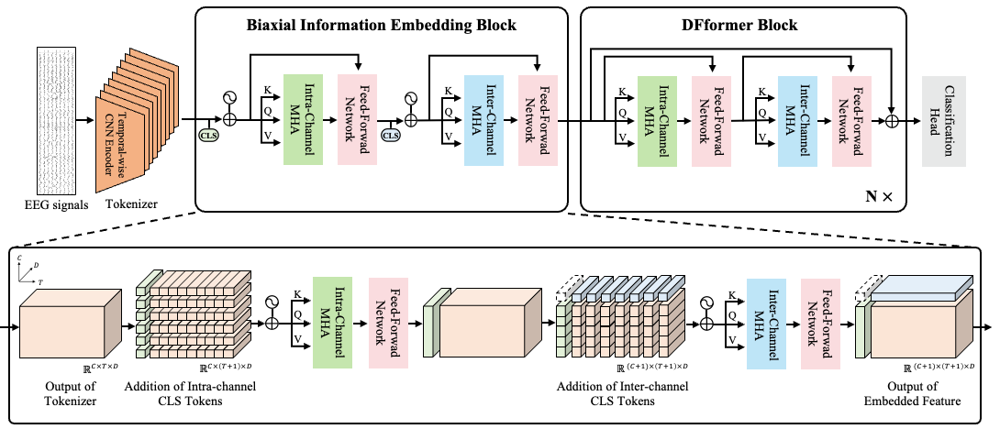

# Towards Domain Free Transformer for Generalized EEG Pre-training

This repository is the official implementations of DFformer in pytorch-lightning style:

```text
TBA
```

## Architecture




## Abstract

> Electroencephalography (EEG) signals are the brain signals acquired from the non-invasive approach. Owing to its high portability and practicality, EEG signals have found extensive applications in monitoring human physiological states across various domains. In recent years, deep learning methodologies have been explored to decode the intricate information embedded within EEG signals. However, since EEG signals are acquired from humans, it has issues with acquiring enormous data for training the deep learning models. Therefore, previous research has attempted to develop pre-trained models that could show the significant performance improvement when fine-tuned when data is scarce. Nonetheless, existing pre-trained models often struggle with constraints, such as the necessity to operate within datasets of identical configurations or the need to distort the original data to apply the pre-trained model. In this paper, we propose the domain free transformer, called DFformer, for generalizing the EEG pre-trained model. In addition, we present the pre-trained model based on DFformer, capable of seamless integration across diverse datasets without necessitating architectural modification or data distortion. The proposed model achieves competitive performance across motor imagery and sleep stage classification datasets. Notably, even when fine-tuned on datasets distinct from the pre-training phase, DFformer demonstrates marked performance enhancements. Hence, we demonstrate the potential of DFformer to overcome the conventional limitations in pre-trained model development, offering robust applicability across a spectrum of domains.

## 1. Installation

### 1.1 Clone this repository

```bash
$ git clone https://github.com/comojin1994/DFformer.git
```

### 1.2 Environment setup

> Create docker container and `databases`, `logs`, and `checkpoints` directory by under script

```yaml
# docker-compose.yml
# Modify the gpu info at devices

devices:
  - /dev/nvidia0:/dev/nvidia0
  - /dev/nvidia1:/dev/nvidia1
  - /dev/nvidia2:/dev/nvidia2
  - /dev/nvidia-modeset:/dev/nvidia-modeset
  - /dev/nvidia-uvm:/dev/nvidia-uvm
  - /dev/nvidia-uvm-tools:/dev/nvidia-uvm-tools
  - /dev/nvidiactl:/dev/nvinvidiactl
```

```bash
$ make start_docker
$ docker exec -it dfformer bash
$ cd dfformer
$ make setup
```

### 1.3 Preparing data

> After downloading the [BCI Competition IV 2a & 2b](https://www.bbci.de/competition/iv/#download), [Sleep-EDF](https://physionet.org/content/sleep-edfx/1.0.0/), and [SHHS](https://sleepdata.org/datasets/shhs) data, revise the data's directory in the `setups/prerocess_{dataset}.py` files

```bash
# 1. BCI Competition IV 2a
$ make preprocess_bci2a

# 2. BCI Competition IV 2b
$ make preprocess_bci2b

# 3. Sleep-EDF
$ make preprocess_sleepedf

# 4. SHHS
$ make preprocess_shhs
```

```python
BASE_PATH = {Dataset directory}
SAVE_PATH = {Revised dataset directory}
DB_PATH = "/opt/pytorch/DFformer/databases/{dataset}.db"
```

## 2. Performance

### 2.1 Trained from scratch

#### Motor imagery datasets

|      Method      |   BCIC2a   |            |            |   BCIC2b   |            |            |
| :--------------: | :--------: | :--------: | :--------: | :--------: | :--------: | :--------: |
|                  |    Acc.    |   Kappa    |  F1-score  |    Acc.    |   Kappa    |  F1-score  |
|   DeepConvNet    |   0.5679   |   0.4239   |   0.5677   | **0.7657** | **0.5235** | **0.7656** |
|      EEGNet      |   0.5584   |   0.4113   |   0.5519   |   0.7457   |   0.5098   |   0.7457   |
| M-ShallowConvNet |   0.5783   |   0.4378   |   0.5778   |   0.7558   |   0.5167   |   0.7475   |
|   **DFformer**   | **0.5841** | **0.4455** | **0.5837** |   0.7618   |   0.5208   |   0.7552   |

#### Sleep stage classification datasets

|  Dataset  |     Method     | Overall metrics |            |            | Per-class F1-score |            |            |            |            |
| :-------: | :------------: | :-------------: | :--------: | :--------: | :----------------: | :--------: | :--------: | :--------: | :--------: |
|           |                |      Acc.       |   Kappa    |  F1-score  |        WAKE        |     N1     |     N2     |     N3     |    REM     |
| Sleep-EDF |  DeepSleepNet  |     0.8190      |   0.7600   |   0.7660   |       0.8670       |   0.4550   |   0.8510   |   0.8330   |   0.8260   |
|           | RobustSleepNet |     0.8270      |   0.7700   |   0.7530   |       0.8670       |   0.3660   |   0.8600   |   0.8640   |   0.8100   |
|           |    U-sleep     |     0.7980      |   0.7200   |   0.7480   |       0.8240       | **0.4470** |   0.8300   | **0.8480** |   0.7900   |
|           |  **Proposed**  |   **0.8370**    | **0.7778** | **0.7809** |     **0.9087**     |   0.4412   | **0.8657** |   0.8472   | **0.8416** |
|   SHHS    |  DeepSleepNet  |     0.8100      |   0.7300   |   0.7390   |       0.8540       |   0.4050   |   0.8250   |   0.7930   |   0.8190   |
|           | RobustSleepNet |     0.8140      |   0.7400   |   0.7360   |       0.7990       |   0.3960   |   0.8310   |   0.8200   |   0.8360   |
|           |    U-sleep     |   **0.8410**    | **0.7800** | **0.7690** |       0.8550       |   0.4360   | **0.8580** | **0.8330** | **0.8600** |
|           |  **Proposed**  |     0.8389      |   0.7739   |   0.7620   |     **0.9104**     | **0.4420** |   0.8417   |   0.7615   |   0.8541   |

### 2.2 Fine-tuned results


## 3. Feature visualization

### 3.1 Visualiztion #1

- Dataset for pre-training: Sleep-EDF and SHHS
- Inference dataset: BCI Competition IV 2a


### 3.2 Visualization #2

- Dataset for pre-training: BCI Competition IV 2a
- Inference dataset: Sleep-EDF


### 3.3 Visualization #3

- Dataset for pre-training: SHHS
- Inference dataset: BCI Competition IV 2a


## 4. Training

### 4.1 Training autoencoder

> Revise the options in config file

```yaml
# {dataset}_config.yaml

### MANUAL ###
use_token: True
apply_cls_head: False
```

```bash
$ make autoencoder
```

### 4.2 Training DFformer from scratch

> Revise the options in config files

```yaml
# {dataset}_config.yaml

### MANUAL ###
use_token: False
apply_cls_head: True
```

```bash
# 1. BCI Competition IV 2a
$ make bci2a

# 2. BCI Competition IV 2b
$ make bci2b

# 3. Sleep-EDF
$ make sleepedf

# 4. SHHS
$ make shhs
```

## 5. Fine-tuning

> Revise the checkpoint path and filename at config files

```yaml
### PATH ###

# This is sample code
WEIGHT_PATH: "{dataset}/lightning_logs/version_0/checkpoints"
WEIGHT_FILENAME: "{checkpoint file name}.ckpt"
```

```bash
# 1. BCI Competition IV 2a
$ make bci2a

# 2. BCI Competition IV 2b
$ make bci2b

# 3. Sleep-EDF
$ make sleepedf

# 4. SHHS
$ make shhs
```
